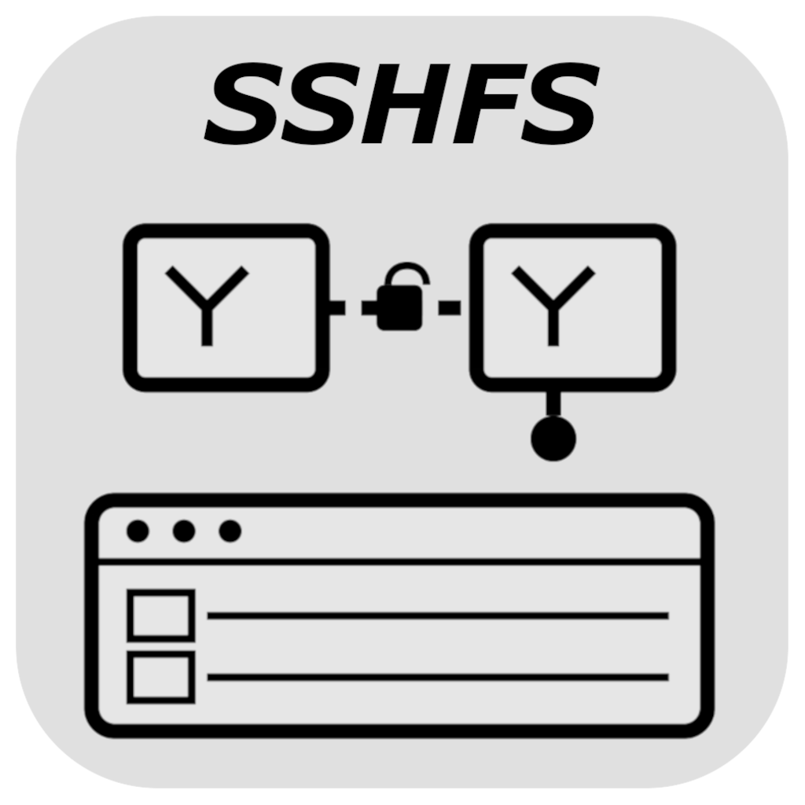
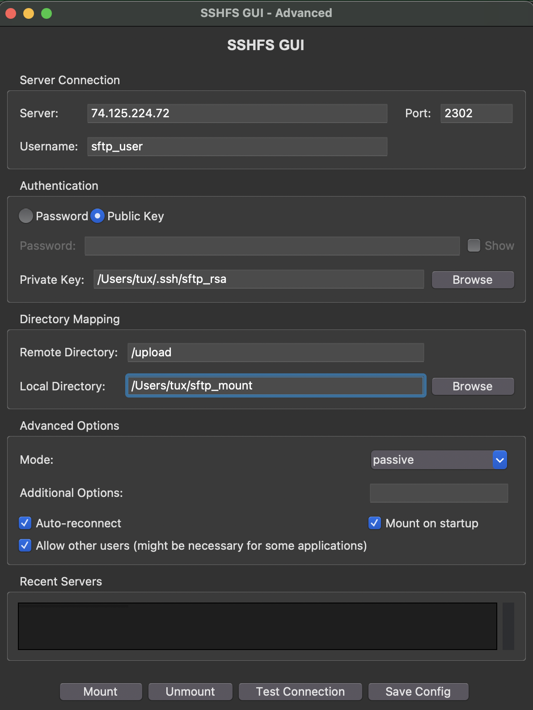

# SSHFS GUI

<div align="center">
  
  <p><em>A complete graphical interface for SSHFS with advanced authentication and configuration options</em></p>
</div>



## Overview

SSHFS GUI is a comprehensive Python-based graphical interface for mounting remote filesystems via SSHFS. It provides an intuitive way to connect to remote servers using either password or public key authentication, with advanced configuration options and persistent connection management.

I vibed this with Claude 4 Sonnett (and then revised it a little) for my convenience because I tried to use a similar GUI on Github that was missing options I use. Note that you can easily use third-party Python packages to build a native .exe or .app of this. Alternatively, ask an AI tool how to make shortcut to it using the cool icon in the `img` folder.

## Features

### 🔐 **Flexible Authentication**
- Password-based authentication with show/hide toggle
- Public key authentication with file browser
- Automatic detection of default SSH keys (`~/.ssh/id_rsa`)

### 📁 **Directory Management**
- Easy remote and local directory selection
- Automatic local directory creation
- Configurable mount points

### ⚙️ **Advanced Options**
- Connection mode selection (passive/active)
- Auto-reconnect functionality
- `allow_other` option for Finder/application access
- Custom SSHFS options support
- Server keepalive configuration

### 💾 **Configuration Management**
- Save and load recent server configurations
- Persistent settings across sessions
- Quick access to frequently used connections

### 🔧 **Connection Tools**
- Built-in SSH connection testing
- Real-time status logging
- Easy mount/unmount operations
- Comprehensive error handling

## Requirements

- Python 3.6+
- `tkinter` (usually included with Python)
- `sshfs` installed on your system
- SSH client (`ssh` command)

### Installing SSHFS

**macOS (as of v15.5):**

I don't recommend installing sshfs through Homebrew, because I believe it depends on libfuse or some related Linux library.

Rather, install BOTH MacFUSE AND SSHFS from here: https://macfuse.github.io/

Note that you have to change your device's security settings and enable the MacFuse kernel extension following these instructions:
https://github.com/macfuse/macfuse/wiki/Getting-Started


**Ubuntu/Debian:**
```bash
sudo apt update
sudo apt install sshfs
```

**CentOS/RHEL:**
```bash
sudo yum install sshfs
```

## Installation

1. Clone or download the repository
2. Ensure Python 3 and required dependencies are installed

## Usage

### Basic Usage
```bash
python3 sshfs_gui.py
```

### Authentication Methods

**Password Authentication:**
1. Select "Password" authentication method
2. Enter your server credentials
3. Provide your password when prompted

**Public Key Authentication:**
1. Select "Public Key" authentication method
2. Browse to your private key file (or use default `~/.ssh/id_rsa`)
3. Ensure your public key is installed on the remote server

### Mounting Filesystems

1. **Configure Connection**: Enter server details and authentication info
2. **Set Directories**: Specify remote path and local mount point
3. **Test Connection** (optional): Verify SSH connectivity
4. **Mount**: Click "Mount" to establish the filesystem connection
5. **Save Configuration**: Store settings for future use

### Advanced Options

- **Allow Other Users**: Enable `-o allow_other` for Finder/application access
- **Additional Options**: Add custom SSHFS parameters
- **Auto-reconnect**: Maintain connection stability
- **Connection Mode**: Configure passive/active mode

## Configuration

Configurations are automatically saved to `~/.sshfs_gui_config.json` and include:
- Server connection details
- Authentication preferences
- Directory mappings
- Advanced options

## Troubleshooting

### Common Issues

**Empty window when running as executable:**
- Run directly with `python3 sshfs_gui.py` instead
- Check that all dependencies are properly bundled

**Permission denied with `allow_other`:**
- Ensure `user_allow_other` is enabled in `/etc/fuse.conf`
- Add the line `user_allow_other` to the file if missing

**Connection timeouts:**
- Verify SSH connectivity: `ssh username@server`
- Check firewall settings and network connectivity
- Use "Test Connection" feature to diagnose issues

**Mount point already in use:**
- Unmount existing filesystem: `fusermount -u /path/to/mount`
- Or use the "Unmount" button in the GUI

## Development

The application is built with Python's `tkinter` for cross-platform compatibility and uses subprocess calls to execute SSHFS commands. Key components:

- **GUI Framework**: tkinter with ttk styling
- **Configuration**: JSON-based settings persistence
- **Process Management**: subprocess for SSHFS execution
- **Threading**: Non-blocking connection tests

## Contributing

Contributions are welcome! Please feel free to submit issues, feature requests, or pull requests.

## License

This project is open source. Feel free to use, modify, and distribute according to your needs.

## Author

Created for academic and administrative use in university computing environments, with a focus on secure, reliable remote filesystem access.
